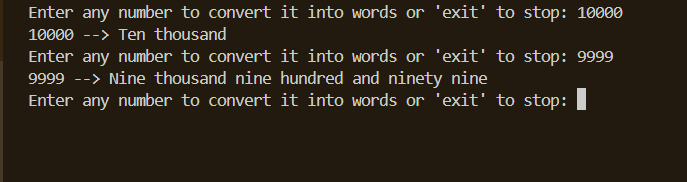

# Convert Numbers To Words

Convert a number to the written word form

### Prerequisites

None

### How to run the script

Execute `python3 converter.py`

## Screenshot/GIF showing the sample use of the script
<!--Remove the below lines and add yours -->

## *Author Name*
<!--Remove the below lines and add yours -->

